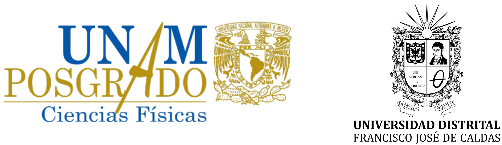

# Ellipsometry Data Analysis Using Open-Source Tools

-----

**Jonathan A. Urrutia-Anguiano**
    Facultad de Ciencias, Universidad Nacional Autónoma de México (UNAM)
    Short academic stay at Universidad Distrital Francisco José de Caldas (UDFJC)

This repository compiles the technical notes, scripts, workflows, and results obtained during a short research stay at the **Laboratorio Nacional Espectroscopía Elipsométrica** in UDFJC.
The work focuses on analyzing ellipsometric data acquired with a **HORIBA commercial ellipsometer**, using open-source software tools for data processing, model fitting, and optical response extraction.

## Research Stay Information

-   **Student:** Jonathan A. Urrutia Anguiano
-   **Program:** Posgrado en Ciencias Físicas (Doctorado), UNAM
-   **Advisor:** Dr. Alejandro Reyes-Coronado
-   **Host institution:** Universidad Distrital Francisco José de Caldas
-   **Host researcher:** Dr. César Aurelio Herreño Fierro
-   **Location:** Bogotá D.C., Colombia
-   **Dates:** *November 12--28, 2025*\
-   **Financial support:** Programa de Apoyo a Estudiantes de Posgrado (PAEP) 2025

## Purpose of This Repository

This repository documents the use of open-source tools to:

1.  **Import, process, and analyze ellipsometric measurements** obtained
    with a HORIBA ellipsometer.\
2.  **Fit optical models** and extract parameters such as dielectric
    functions, film thicknesses, effective refractive indices, and
    structural parameters of disordered metasurfaces.\
3.  **Compare fitting algorithms, modeling approaches, and analysis
    pipelines** across different open-source packages.

## Tools Explored

### RefEllips

-   Importing HORIBA datasets\
-   Initial parameter fitting\
-   Parameter sweeps\
-   Goodness-of-fit evaluation (MSE)

### pyElli

-   Dielectric function estimation\
-   Effective medium modeling\
-   Custom spectral-analysis routines

### regress-pro (pending)

## Repository Structure

    ├── assets/
    │   ├── logo_facultad_ciencias_unam.png
    │   └── logo_udistrital.png
    ├── data/
    │   ├── raw/
    │   └── processed/
    ├── notebooks/
    │   ├── refellips_examples.ipynb
    │   ├── pyelli_workflow.ipynb
    │   └── dielectric_function_estimation.ipynb
    ├── models/
    │   └── metasurface_effective_model.json
    ├── scripts/
    │   ├── import_horiba.py
    │   ├── fit_refellips.py
    │   └── fit_pyelli.py
    └── README.md

## Scientific Context

This work forms part of my PhD project on the **theoretical, numerical,
and experimental study of disordered plasmonic metasurfaces for
biosensing applications**. It includes comparison of measurements from
the INAOE and the GICD, evaluation of phase‑retrieval algorithms, and
determination of effective dielectric functions.

## Contact

**Jonathan Urrutia**\
Facultad de Ciencias, UNAM\
Email: \[your email here\]
